# Awesome Identicon 

> A curated list of Identicons-like (Avatars, Identicons, and Hash Visualization) original ideas and libraries, *sorted by date of appearance*

<!-- 1999 -->
## RandomArt
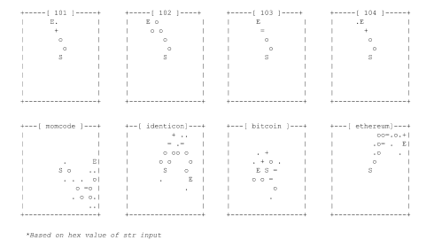 <!-- w/ https://github.com/qistoph/RandArt -->

[The drunken bishop](http://citeseerx.ist.psu.edu/viewdoc/download?doi=10.1.1.424.4771&rep=rep1&type=pdf) algorithm for [OpenSSH](https://www.openssh.com/txt/release-5.1) RandomArt, by Alexander von Gernler — 2008, *based on random art concept of [Perrig and Song paper](https://users.ece.cmu.edu/~adrian/projects/validation/validation.pdf "Hash Visualization: a New Technique to improve Real-World Security") — 1999*

<!-- 2007 -->
## Identicon
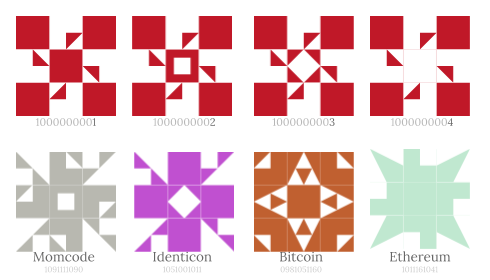

[Identicon](https://github.com/donpark/identicon), by [Don Park](https://github.com/donpark) — 2007

## MonsterID
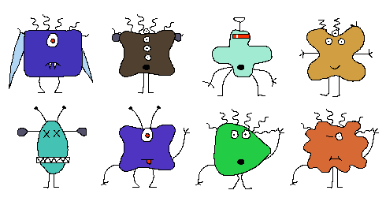

[MonsterID](https://github.com/splitbrain/monsterID), by [Andreas Gohr](https://github.com/splitbrain) — 2007

## Wavatars
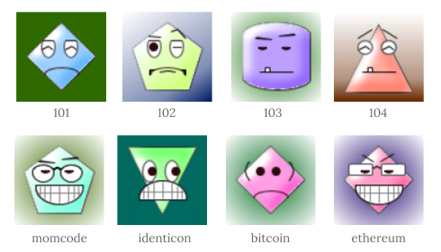

[Wavatars](http://www.shamusyoung.com/twentysidedtale/?p=1462), by [Shamus Young](https://github.com/ShamusYoung) —  2007

## WP-Identicon
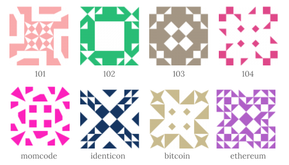

[WP-Identicon](http://scott.sherrillmix.com/blog/blogger/wp_identicon/), by [Scott Sherrill-Mix](https://github.com/sherrillmix) —  2007

<!-- 2010 -->

## Retro
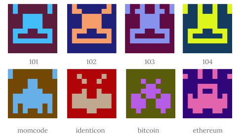

[Retro](), by Gravatar —  2010? <!-- Original author unknow! -->

<!-- 2011 -->

## Vash
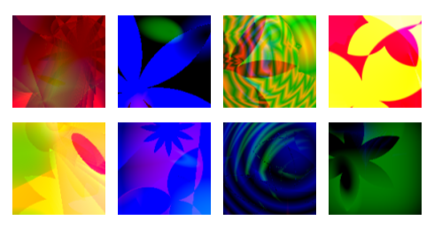

[Vash](https://github.com/thevash/vash), by Terrence Cole —  2011

## RoboHash
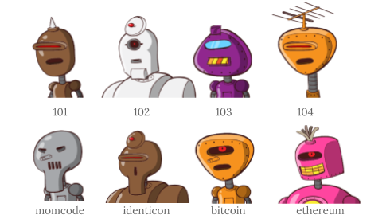

[RoboHash](https://github.com/e1ven/Robohash), by [Colin Davis](https://github.com/e1ven)  —  2011

<!-- 2012 -->

## Stitchies
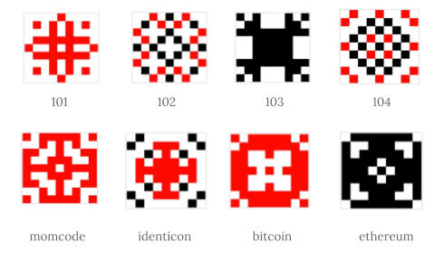

[Stitchy](https://github.com/craftoid/stitchies-p5), by [Martin Schneider](https://github.com/craftoid) — 2012

<!-- 2013 -->

## Github Identicon
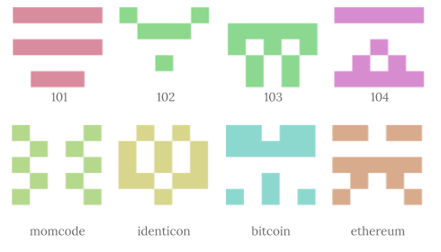

[Github Identicon](http://identicon.net/), by [Jason Long](https://github.com/jasonlong) — 2013

<!-- 2014 -->
## Bubble
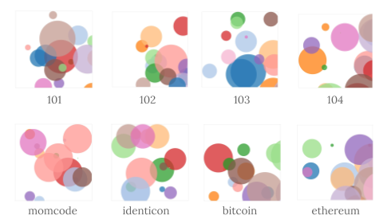

[Bubble Identicons](https://github.com/dakridge/identicon), by [Doug Akridge](https://github.com/dakridge) — 2014

## Jdenticon
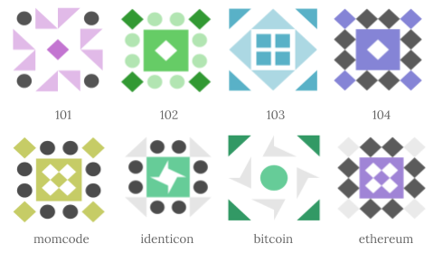

 [jdenticon](https://github.com/dmester/jdenticon), by [Daniel Mester Pirttijärvi](https://github.com/dmester) — 2014

## Blockies
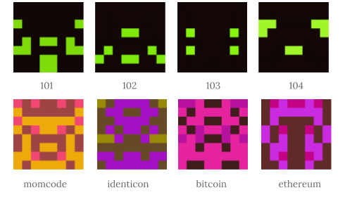

[Blockies](https://github.com/ethereum/blockies), by [Alex Van de Sande](https://github.com/alexvandesande) — 2014

## Adorable Avatars
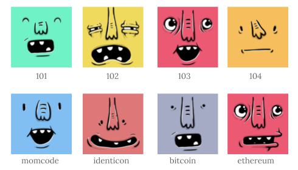

[Adorable Avatars](https://github.com/adorableio/avatars-api-middleware), by [Jim Remsik](https://github.com/bigtiger)<!-- [Adorable IO](https://github.com/adorableio) -->— 2014

## FlatHash
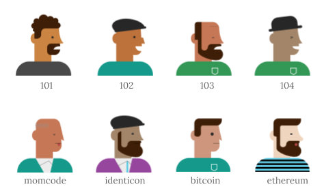

[FlatHash](http://flathash.com/), by [Roberto Horta](https://www.linkedin.com/in/bertohorta/) — 2014

<!-- 2015 -->

## IdentiHeart
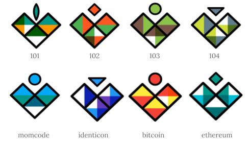

[IdentiHeart](https://github.com/Schlipak/IdentiHeart), by [Guillaume Schlipak](https://github.com/Schlipak) — 2015

## Florash
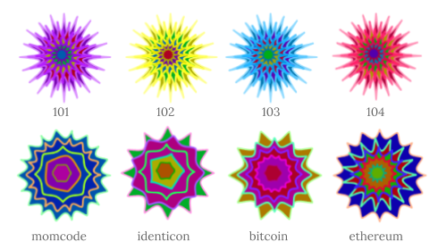

[Florash](https://github.com/AKRFranko/Florash), by [Francois Lafortune](https://github.com/AKRFranko) — 2015

<!-- 2016 -->

## Jazzicon
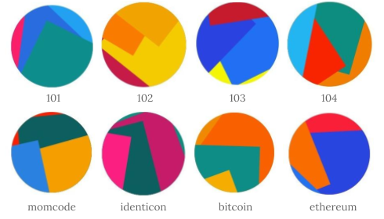

[Jazzicon](https://github.com/danfinlay/jazzicon), by [Dan Finlay](https://github.com/danfinlay) — 2016

## Ringicon
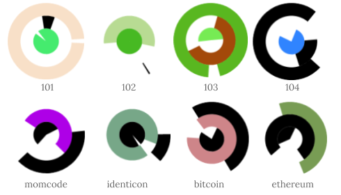

[Ringicon](https://github.com/splitbrain/php-ringicon), by [Andreas Gohr](https://github.com/splitbrain) — 2016

<!-- 2017 -->

## Circular
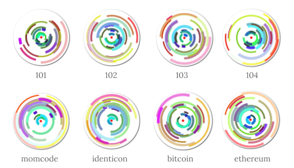

[Circular Identicons](https://github.com/ea7ababe/identicon), by [Agni Flechette](https://github.com/ea7ababe)  —  2017

## Gradient
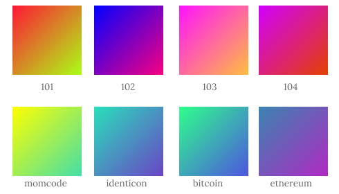

[Gradient Avatars](https://github.com/tobiaslins/avatar), by [Tobias Lins](https://github.com/tobiaslins)  —  2017

<!-- 2018 -->

## HashIcon
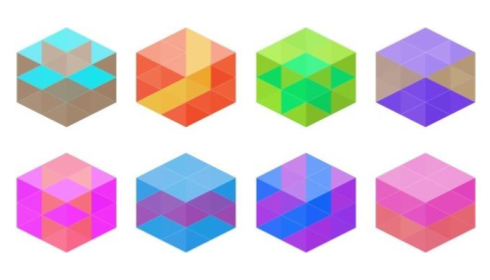

[HashIcon](https://github.com/ETCDEVTeam/hashicon), by [Richard Schumann](https://github.com/scco) — 2018

## Hexicon
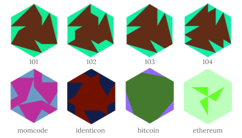

[Hexicon](https://github.com/naknomum/hexicon/), by [Jon Van Oast](https://github.com/naknomum) — 2018

## Hydro-Snowflake
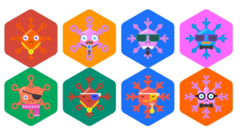

[Hydro-Snowflake](https://github.com/cyphercodes96/Hydro-Snowflake-Identicon-Generator), by [Rawad Ahmad Salhab](https://github.com/cyphercodes96) — 2018

## Pictogrify
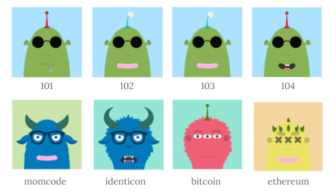

[Pictogrify](https://github.com/luciorubeens/pictogrify), by [Lúcio Rubens](https://github.com/luciorubeens) — 2018

## monKey <!-- NOT an Open-source -->
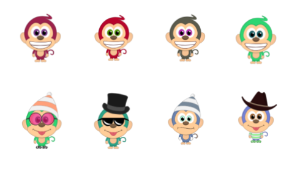

[monKey](http://www.monkeygen.com/), by [Amir Hagafny](https://medium.com/@amirhagafny) — 2018

## Polkadot-Identicon <!-- NOT an Original idea, adapted from Jazzicon -->
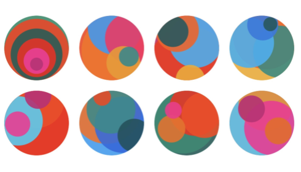

[Polkadot-Identicon](https://github.com/polkadot-js/apps/tree/master/packages/ui-identicon), by [Pokadot](https://polkadot.network/) — 2018

# Honorable mention
## QR-Code
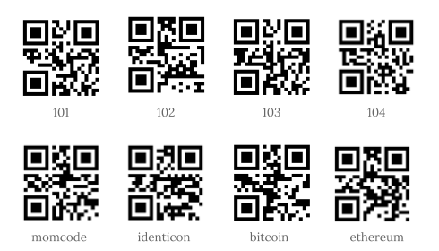

[QR-code](http://www.qrcode.com/), by [Denso-Wave](https://www.denso-wave.com/) — 1994

## Letter Avatar
*It’s not clear who come first with the First Letter & Initials Avatars concept, (widely used by Google GMail) but there are several open source libraries from 2014, such as [LetterAvatar](https://github.com/ksz2k/letter_avatar), [Letterpic](https://github.com/yakovlevga/letterpic) and [ngletteravatar](https://github.com/uttesh/ngletteravatar)*

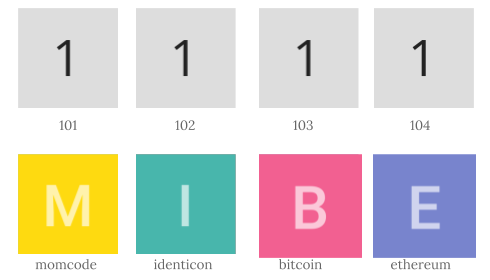

Letter Avatar — 2014

## Animal Identicon
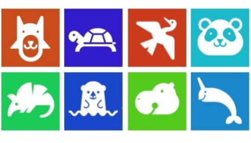

Anonymous animals, by Google docs — 20??
<!-- also available [animal-identicon-js](https://github.com/camelmasa/animal-identicon-js) -->

# Contributing

1. Fork it
2. Create your update branch (`git checkout -b my-new-identicon`)
3. Commit your changes (`git commit -am 'Add some identicon'`)
4. Push to the branch (`git push origin my-new-identicon`)
5. Create new Pull Request