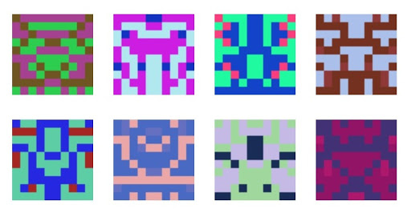
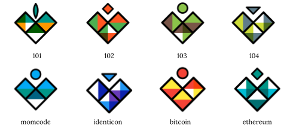
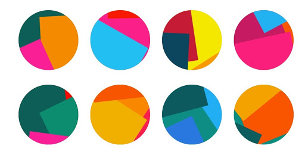
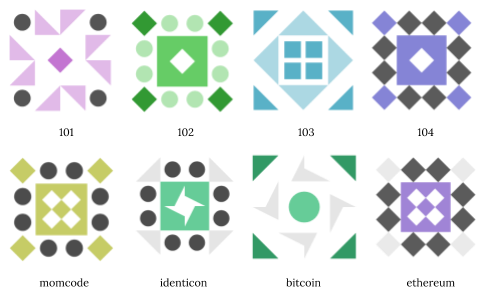
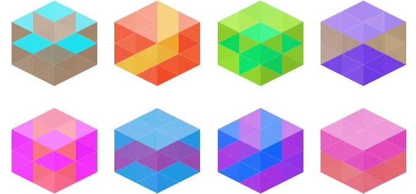
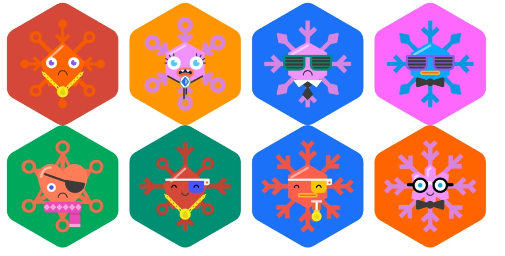
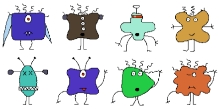

# Awesome Identicon 

> A curated list of Identicons (Avatars, Identicons, and Hash Visualization)

 ## Identicon

* [Stitchies](https://github.com/craftoid/stitchies-p5 "Martin Schneider - 2012")
 Stitchy Identicon: Stitchies for Processing - Identicons for the Web 2.0

* [Blockies](https://github.com/ethereum/blockies "Alex Van de Sande - 2014")

[Blockies](https://github.com/ethereum/blockies "Alex Van de Sande - 2014") - <1k library that generates blocky identicons

* [IdentiHeart](https://github.com/Schlipak/IdentiHeart "Guillaume Schlipak - 2015")

IdentiHeart by Guillaume Schlipak - 2015

* [jazzicon](https://github.com/danfinlay/jazzicon "Dan Finlay - 2016") - Jazzy deterministic identicons for a more entertaining future.

* [jdenticon](https://jdenticon.com/ "Daniel Mester Pirttijärvi - 2017") - avascript library for generating identicons. Running in the browser and on Node.js.

* [HashIcon](https://github.com/ETCDEVTeam/hashicon "Richard Schumann - 2018") - Generates a beautiful representation of any hash

* [Hydro-Snowflake]( "Rawad Ahmad Salhab - 2018") - Generates unique snowflake identicons based on seed phrases

 ## MonsterID
 * [monsterID](https://github.com/splitbrain/monsterID "Andreas Gohr 2007") - The original MonsterID implementation

 
* [sandfoxme/monsterid](https://github.com/sandfoxme/monsterid "Anton Smirnov 2015") - MonsterID adaptation for Composer and modern PHP versions
* [gabrieledarrigo/monsterid](https://github.com/gabrieledarrigo/monsterid "") - Node.js porting of the original PHP library

 ## HashIcon
 * 
 
